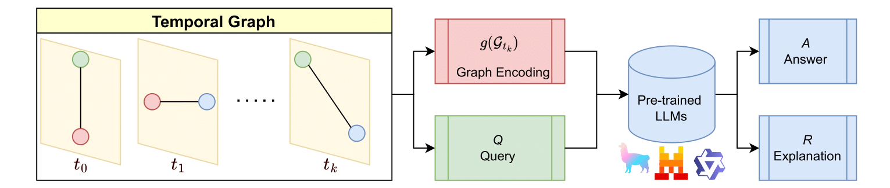

# TGTalker
### Official Repository for "Are Large Language Models Good Temporal Graph Learners?"




## Installation Instructions
```
module load python=3.10
python -m venv vllm_env
source vllm_env/bin/activate
pip install vllm
```

install TGB from source to download datasets and run evaluation
```
git clone git@github.com:shenyangHuang/TGB.git
pip install -e .   
```

## How to run temporal link prediction with `reasoning_main.py`
```
#* base model
CUDA_VISIBLE_DEVICES=0 python -u reasoning_main.py --batch 200 --model qwen1.7b --in_size 5 --bg_size 300 --data tgbl-subreddit --nbr 2 

#* base model + icl
CUDA_VISIBLE_DEVICES=0 python -u reasoning_main.py --batch 200 --model qwen1.7b --in_size 5 --bg_size 300 --data tgbl-subreddit --nbr 2 --icl

#* base model + cot
CUDA_VISIBLE_DEVICES=0 python -u reasoning_main.py --batch 200 --model qwen1.7b --in_size 5 --bg_size 300 --data tgbl-subreddit --nbr 2 --cot --logfile reddit_log.json


#* base model + cot + icl
CUDA_VISIBLE_DEVICES=0 python -u reasoning_main.py --batch 200 --model qwen1.7b --in_size 5 --bg_size 300 --data tgbl-subreddit --nbr 2 --cot --icl --logfile reddit_log.json
```

## How to run temporal link explantion

### Generating post-hoc explanations

We assume that:

- We have an answer cache
- We have the prompt cache

### Generate Answer Cache

**Run the first 5,000 lines:
** This is the model you want the answer to be from

1. Get answer (e.g.)
    > CUDA_VISIBLE_DEVICES=0 python -u reasoning_main.py --batch 200 --model llama3 --in_size 5 --bg_size 300 --data tgbl-subreddit --nbr 2 --icl -—cache_dst

2. Create folder called `answer_cache` under `posthoc_explanations`
3. copy {{answer_cache}}  to `answer_cache`

### Generate Prompt Cache

**Run the prompt generation
** Keep `gpt-4.1-mini-2025-04-14`, path currently hard-coded in `main.py`

1. Get prompts (e.g.)
    > python3 ./generate_reasoning_main.py --batch 100 --model gpt-4.1-mini-2025-04-14 --in_size 5 --bg_size 300 --data tgbl-subreddit --nbr 2 --icl --max_no_of_prompts 5000

2. Create folder called `output` from `gpt-batch` into `posthoc_explanations`

### Run post-hoc explanation

** This is the model you want the explanation to be generated from + categorization.

> python3 ./main.py --data tgbl-subreddit --model llama3
